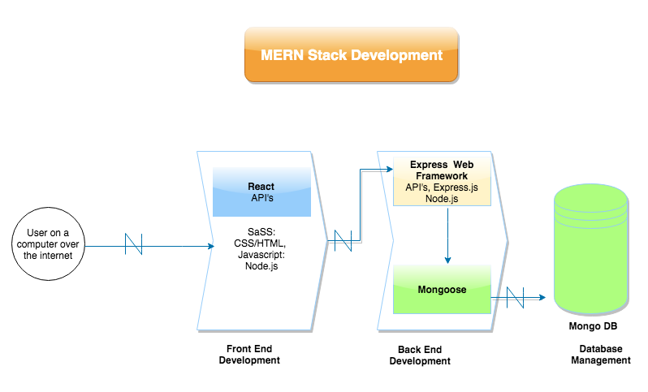

# Cloud-Fitness-App

## Description of the App
### Purpose:
The purpose of this assessment is to design a web application for a commercial client. For this assessment we are creating a web application for a gym. Our gym app is called Cloud Fitness and it will store the information of the gym members, help them book gym sessions and select their chosen workout routines. 

Our client is the owner of Cloud Fitness and this gym web app will benefit her in a number of ways being:
- Our client envisions that all bookings will be made online and this web app will allow this to occur.
- In future iterations, it will give our client statistics of usability and data for accounting and marketing purposes.
- Our client envisions that this web app will create a social community where gym members create friendships, encourage each other and create a positive and inclusive environment.
- The web app is a necessary requirement to the gym operations due to all the bookings and payments being made online and the gym cannot function without it. The whole concept of this gym is to run 24/7 and with minimal interactions with staff during staff hours. It is also crucial to minimise the administration and time required to run the business.

There are a number of ways this gym web app will benefit society. These are:
According to the New Daily, 56% of Australians are inactive or don't get enough exercise, increasing their risk of cancer, weight gain and type 2 diabetes. Therefore, going to the gym is a very important part of a person's life as it helps to:
- Increase your body's physical activity
- Relieve stress
- Improve your sleep
- Improve your social life by creating friends at the gym.

Cloud Fitness attempts to make this easier for Australians by enabling them to register, book gym sessions and select workout routines online.

### Functionality
Minimum Viable Product(MVP):
- Register for a gym account with your full name, date of birth, email, phone number, billing information and physical profile(Height, weight, gender, level of fitness etc).
- Once logged in, you can read, book and delete your gym session.
- WHile booking a gym session, user selects a workout routine. Each gym member(user) chooses:
    - GOALS: flex & relax, aerobic, strength
    - LEVELS: developed, intermediate, advanced.
    - PEOPLE: single, couple, families, groups(maximum 8 people)
    - TIME 20, 30, 40 or 50 minutes.

Future Enhancements once we've completed the MVP:
- The gym users will then be directed to a Payment Gateway, where they can pay their gym sessions easily.
- After the gym session is completed, a feedback poll will pop-up to analyse results and generate statistics.

### Tech Stack
For this web app, we will be using MERN, SASS and Heroku.
MERN stands for MongoDB Express.JS React.JS Node.JS
- MongoDB: An open source database management system that uses a document-oriented database model which supports various forms of data.
What are you using it for?
Our team is using MongoDB as a document database to store the data of our gym users i.e ID, full name, date of birth, email, phone number, billing information and physical profile(Height, weight, gender, level of fitness). Also, to facilitate all the needs of he gym web app, we will need a Users table, a services table and a payments table.

- Express.JS: A minimal and flexible Node.js web app framework that provides a set of features for web applications.
What are you using it for?
Our team will use Express as our back-end and make routes to create, read, update and delete gym sessions. We will also have routes to subscribe/unsubscribe, the payment process, updating user details, selecting workout routines and classes and generating feedback polls.

- React.JS: A javascript library for building user interfaces. React is maintained by Facebook and a community of individual developers and companies.
What we are using it for:
We plan to use React as our front-end to display the contents of our gym web app. We plan to add routes for the contents being displayed on our browser. These contents are: authentication process, calendar for gym sessions, managing user profile, managing workout routines, payment process and feedback polls.

- Node.JS: An open-source, cross-platform, JavaScript runtime environment that executes JavaScript code outside of a browser. 
What we are using it for:
Our team plans on using Node to run our startup scripts to run the server-side, install any dependencies, for postman when we use it to send requests to the URL and to make our JavaScript asynchronous.

- SASS a CSS framework. It is the most stable and powerful professional grade CSS extension language in the world.
What we are using it for:
Our team intends to use SASS as our CSS framework for our web app. SASS generates CSS files. We plan to use SASS to style the contents of our web app, keep the CSS dry and the style consistent.

- Heroku is a deployment platform for our web app. Heroku is a cloud platform service supporting several programming languages.
What we are using it for:
Our team plans to use Heroku as our deployment platform for our web app. Heroku will generate a URL for our web app.

### Target Audience
The ideal customer for Cloud Fitness is a 18-35 years old individual, living or working within five miles of one of our gym clubs. That also believe fitness is important to health and a great way to make friends and spend time with them.

Market segmentation:
According to the econ gym, 50% of their customers were aged between 24-35. These customers were finished with school and were able to afford gym. They had the time and money.

30% of their customers were aged between 18-20. These customers were mainly still in school. They had the time to come to the gym regularly. They also have school breaks during the summer holidays in which they can spend more time at the gym, thus creating an increase in customers during the months of November to February.

20% of their customers were above 35 years old. This was their smallest market segmentation because people 35+ have a job and a family and as people get older, they tend to lose their motivation to attend gym regularly. Through the development of our gym web app, we hope to improve this statistic.

### Planning Methodology
Through meetings we have decided on the use of Trello to plan and manage our Product.  We have agreed to use Github for code management and heroku as our deployment platform. We are using Slack for commmunication and sharing of diagrams. We have agreed to being on-site Monday to Wednesday and off-site at other times. When offsite and working on the project communication is via Slack and through Github reviews and pull requests.

When creating our Trello board, we all worked together to create the cards. Each card shows the level of work or difficulty. Every card is clearly marked with the team member or members who worked on it.  Each team member should move the cards on the trello board to reflect where they are at with that piece of work. This enables us to do work in sprints, to specifications of the client and follow iterations as with agile methodology.

We have made cards in Trello that help us to divide up the work. At the moment what areas we work on, are determined by the team. We agree to working on feature branches and the group members to do code reviews and the person who creates the branch, merges the branch into master or via agreement. We agree to regular commits when working on code. Should conflicts arise the parties with conflicting code should work together or be in agreement what code to accept and merge.

We agreeed to do daily stand ups on Monday to Wednesday and regular communication on Slack when working off-site. As a team we make requests for other meetings as deemed necessary.

At our meeting with the client, we agreed that our main forms of communication would be through email or slack. We sent through wireframes of our design for the website and asked further input from the client on design via email.  The client will sign off on the design and we'll notify the client regarding our deployments for heroku during the project so that progress can be seen and feedback given.

## R2  Diagrams
### User Registration, Login, and Logout

### Service - End to End

### Payments - Part of End to End Process

### Edit, Cancel Booking Details and Unsubscribe User

## R3 Diagrams
### App Architecture Diagram

## R4 User Stories
- Website should be design with the user in mind with clearly layed out designs and flow process through the application, utilising placement and colour to easily draw user to where they want to go. With apporpriate messages of sucess and error so a user knows that the process occured successfully or what went wrong, so a user can correct the issue easily. 
### User Admin
-  I can register, with username (optional),email and password with password encryption(passport). 
- I am able to log in / log out with username (optional) or email, and password.  
- I can set availability, this capability was an instruciton by the Client to set up in the code as 24/7 * 8 slots per time slot, with timeslots of 20, 30, 40, 50 mins.  We have put it to the client potential for 30 and 50 minutes slots to cause overfolow into the next hour.  We also asked if the were any set breaks between between appointments.
- I can create, edit, a timetable. We are awaiting data from client so this is not yet included in our design wireframes. We will create wireframes for the the timetable once client can provide
- I can see all bookings that have made, and who has booked in. 
- I can set prices and change prices

### User Client
-  I can register, with username (optional),email and password with password encryption(passport). 
- I am able to log in / log out with username (optional) or email, and password. 
- I can edit my user profile.  Clearly viewable place on the website indicating to the user to button placement for editing their profile. 
- I can book a session. A user can book in for class or a workout session for the ability to set the timeframe for the session.
- I can set a level
- I can add addition participants to my booking. 
- I can edit or cancel an appointment.
- I can view my appointments
- I can pay for my appointments

### Future interations
- I can see msg from clients, chat messaging Chat bot.

## R5 Wireframes
### Desktop
.png)
.png)
.png)

### Mobile
.png)
.png)
.png)
.png)

## ScreenShots

### Trello Board

Definitions to Design:

.png)

Progress to Testing

.png)
.png)

### Future Enhancements:

.png)

### Testing Spreadsheet

.png)

# T3A1 - Workbook

### Q1. Provide an overview and description of a standard source control process for a large project

A standard source control process for a large project would be using github. 

##### What is Github? 
To understand what GitHub is, one must unerstand what Git is.
Git is a version control system that is preferred by most developers as it has multiple advantages over the other version control systems.
The Hub in GitHub is for developers that store their projects and network with like minded individuals. Some of the many benefits GitHub has are: repositories(Repos), forking repos, cloning repos, creating pull requests and reviews, social networking and changelogs.

##### Overview of a standard source control process for a large project

In a large project where multiple developers are working on the same team, it would be wise to create a git server that is a centralised authoritative git server. In a large project, you would also use a master branch as the main production branch. For each module in the project, it would be a git submodule, and each submodule would have different branches for each team member to work on. A person would then be assigned to each submodule to handle pull requests and reviews from the team members in that submodule, and then issue a pull request to the team lead who would then merge the changes in the submodule with the master branch(main production branch). In a large project, you would also use tags to identify commits that are for specific releases.

### Q2. What are the most important aspects of quality software?

To understand what the most important aspects of quality software are, we must understand what quality software is?
Software quality measure whether software satisfies tis requirements.
Software requirements are classified as either functional or non-functional

Functional requirements specify what the software should do.
Non-Functional requirements specify how the system should work.

The CISQ software quality model provides us with a decent understanding of software quality.
CISQ software quality model defines 6 important aspects of software quality. These are:
- Reliability
- Performance Efficency
- Security
- Maintainability
- Rate of Delivery
- Testability 

Reliability is the risk of software failure and the stability of a program when exposed to unexpected conditions. Reliable software has minimal downtime, good data integrity, and no errors that directly affect users.

Performance Efficiency is how an applications use of resources affects its customer satisfaction and response times. Factors that contribute to performance efficiency are: 
- source code design
- individual architectural components
- software architecture

Security of a software is determined by how well it protects information against the risk of software breaches. Architectural weaknesses and poor coding skills often lead to software breaches.

Maintainability of a software is determined by how easily you can modify the software, transfer it inbetween different development teams and adapt it for different purposes. In order to make a software maintainable, consistent coding in all parts of the application and compliance with software architectural rules is necessary.

Rate of Delivery of a software is how often new software versions are shipped to customers. Because new software versions come with improvements to that app that impacts a customer in a postive manner, higher rates of delivery results in better software quality.

Testability is an important aspect of software quality because quality software rquires high degrees of testability. This is because when testing software, finding faults in the software and fixing them before shipping it to your customers results in better software quality for customers.

#### Demonstrating the 6 software quality characteristics

Reliability can be measured by counting the number of high priority bugs found in production. Load Testing can also be used which is assessing how the software functions under ordinardy conditions of use.

In order to measure Performance efficiency, load testing can also be used. Determining the maximum operating capacity of an application using stress testing can also be conducted.

In order to measure security, you can assess the time i takes to fix vulnerabilities in the software. Security can also be measure by checking security incidents that occurred in previous software versions.

In order to measue maintainability, you can count the number of lines code because softwares with long lines of code are harder to maintain and therefore changes made are likely to lead to errors.

In order to measure the rate of delivery, you can count the number of software releases.

### Q3. Outline a standard high level structure for a MERN stack application and explain the components

MERN Stack is a JavaScript stack that's used for easier and faster deployment of full-stack web applications.
MERN stack is made up of 4 different technologies, these are:
- MongoDB
- Express
- React
- Node.JS

##### What is MongoDB and what's it used for?
MongoDB is a NoSQL database where each record is a document comprising of key-value pairs similar to JSON objects. MongoDB allows users to create databases, tables and schemas etc.

##### Why do people use MongoDB?
- MongoDB is fast as it's easy to index documents being a document-oriented database
- Scalability is another reason people use MongoDB as large amounts of data are able to be divided into several machines.
- MongoDb uses JavaScript interface through which users can do operations for e.g. querying, deleting records and updating records.

##### What is Express and what's it used for?

Express is a Node.js framework. Rather than writing the code using Node.js and creating loads of Node modules, Express makes it simpler and easier to write the back-end code. Express helps in designing great web applications and APIs. Express supports many middlewares which makes the code shorter and easier to write.

##### Why do people use Express?

- Asynchronous and Single-threaded.
- Effecient, fast & scalable
- Has the biggest community for Node.js
-Express promotes code reusability with its built-in router.
- Robust API

##### What is React and what's it used for?

React is a JavaScript library that is used for building user interfaces. React is used for the development of single-page applications and mobile applications because of its ability to handle rapidly changing data. React allows users to code in JavasScript and create UI components.

##### Why do people use React?

- Virtual DOM – A virtual DOM object is a representation of a DOM object. 
- JSX is another reason why people use React. JSX Stands for JavaScript XML. It's an HTML/XML JavaScript Extension in React that makes it easier and simpler to write React components.
- ReactJS supports Components. Components are the building blocks of UI wherein each component has a logic and contributes to the overall UI. 
- High Performance features like Virtual DOM, JSX and Components makes it much faster than the rest of the frameworks out there.
- Ability to develop Android and IOS apps is another reason why React is popular. With React Native, you can easily code Android or IOS apps with just the knowledge of JavaScript and ReactJS.

##### What is Node.JS and what's it used for?
Node.js provides a JavaScript Environment that allows users to run their code on the server. Node pack manager i.e. npm allows the user to choose from thousands of free packages to download.

##### Why do people use Node.JS?
- Open source JavaScript Runtime Environment
- Node.JS follows a single threaded model.
- Data Streaming
- Node.JS has a fast code execution and is built on Google Chrome's JavaScript engine.
- Node.JS is highly scalable

### Here is the Architecture Diagram of a MERN stack application

### Q4. A team is about to engage in a project, developing a website for a small business. What knowledge and skills would they need in order to develop the project?

Every Web Application has 3 parts. These 3 parts are: Front-End, Back-End and Database.
For the Front-End, you need to know languages, technologies, frameworks and libraries.

Languages:
There are many coding languages out there, some of them are: 
- JavaScript
- Ruby

Technologies:
- HTML
- CSS

Frameworks:
There are many CSS frameworks out there, some of them are:
- Bulma
- Bootstrap
- SASS

Libraries:
- AngularJS
- React
- jQuery

For the back-end, you need to know server-side languages such as:
- ASP .NET
- PHP
For the back-end, you can also use Express. Express helps in designing great web applications and APIs. Express supports many middlewares which makes the code shorter and easier to write.

For the Database, you can use relational databases or document-oriented databases. An example of each of these are:
- PostgreSQL - Relational database
- MongoDB - Document-oriented database

### Q5. With reference to one of your own projects, discuss what knowledge or skills were required to complete your project, and to overcome challenges

One of my previous assessments was creating a two-sided marketplace that was a platform for economic exchange between the supplier and the buyer. Our two-sided marketplace was similar to Etsy but used for selling tech products only.
The knowledge/skills that were required for this project were:
- Ruby on Rails: Ruby on Rails is a web application framework written in ruby. Rails is an MVC framework. MVC stands for Model, View and Controller. Ruby on Rails provides default structures for a database and webpages.
- Visual Studio Code: a cross-platform, lightweight but powerful source code editor which runs or your desktop. It includes support for debugging, embedded Git control and GitHub, syntax highlighting, intelligent code completion, snippets, and code refactoring. It's available for Windows, macOS and Linux.
- HTML/CSS
- For our CSS, we used a CSS framework called Bulma. Bulma is a free, open source CSS framework based on Flexbox and used by more than 200,000 developers.
- Cloudinary: cloudinary is an end-to-end image management solution for your website and mobile apps. You can easily upload images to the cloud, automatically perform smart image manipulations without installing any complex software. 
- Stripe: Stripe is a tech company that allows businesses to make and receive payments over the internet. 
- Trello: Trello is a task management app that gives you a visual overview of what is being worked on and who is working on it. 
- GitHub: A global company that provides hosting for software development version control using Git.
- Slack: Our main source of communications were through Slack and Trello. Slack is essentially a chat room many companies and organisations use. It's designed to replace email as your primary method of communication and sharing.

### Q6. With reference to one of your own projects, evaluate how effective your knowledge and skills were for this project, and suggest changes or improvements for future projects of a similar nature

The previous group assessment i worked on was creating a two-sided marketplace that was a platform for economic exchange between the supplier and the buyer. When starting off in this assessment, our group had a limited understanding of how to use GitHub and creating different branches for different submodules.
We would all push our work to the master branch, and this practice created many problems for us. One of them being a merge issue. 
We asked Janel and Matt how to fix this problem, and they taught us a solution. They said for each submodule you're working on in the assignment, create a new branch and do a pull request where other group members can review the code and then merge it with master. For example:
If someone in the group is working on authentication, then they would create a branch called authentication and then push it to their branch on GitHub up once they've completed it  and then do a pull request.

Implementing this helped our group gain experience in how large projects would be handled in future circumstances.

Furthermore, another problem we had in the two-sided marketplace assessment was ActiveRecord Foreign Key Violations.
This problem occurred when we tried to delete/update our order items in our marketplace.

In order to fix this problem, Matt helped our group and told us to clear our database and set it up again by doing rails db:drop, rails db:create and rails db:migrate in the terminal.

In a future Ruby on Rails project, if i receive a ActiveRecord:Foreign key violation error, i plan to implement the code that Matt taught us.

### Q7. Explain control flow, using an example from the JavaScript programming language

Control flow is the order that the instructions, statements or functions are executed. Sometimes in an extreme situation the normal top to bottom flow we know about is not obeyed, this is where control flow statements come in, they determine how the program is being executed. Control flow means that when you read a script, you must not only read from start to finish but also look at program structure and how it affects order of execution.

Control flow statements are those that make decisions about what happens in a program.

For example:

let pet = prompt("What type of pet do you have?","Type your lunch choice here");

switch(pet){
  case 'dog':
    console.log("Man's best friend!");
    break;
  case 'cat':
    console.log("Feisty felines!");
    break;
  case 'fish':
    console.log("Not much company, but nice to look at.");
    break;
  case 'snake':
    console.log("Slithering friend!");
    break;
  default:
    console.log("A " + pet + " I am unfamiliar with. Tell me about it.");
}

Based on the code above, the value of "pet" has an influence of the part of the code that's being executed, which in-tuurn affects the control flow of the program.

### Q8. Explain type coercion, using examples from the JavaScript programming language

Type Coercion is the automatic or implicit conversion of values from one data to another data. For example: from strings to numbers.
The difference between type coercion and type conversion is that type coercion is implicit whereas type conversion can be either implicit or explicit.

#### For example:

##### const value3 = '4';
##### const value4 = 8;
##### let sum = value1 + value2;
##### console.log(sum);

In the example above, JavaScript coerced the 8 from a number into a string and then concatenated the two values together. The sum is equal to 48 in the above example. JavaScript had a choice between a string or a number and chose to use a string.

In order to return a value of 12 from 4 + 8, you'd have to convert the '4' into a number using the number method which is:

##### sum = Number(value3) + value4;

### Q9. Explain data types, using examples from the JavaScript programming language

A Data Type is a classification that dictates what a variable or object can hold in computer programming. Data types are important aspects in all programming languages.

In JavaScript, there are two different types of data. These are primitives and objects.

- A primitive is a data type that's not an object and doesn't have any methods.

The latest ECMAScript standard defines eight data types with seven of them being primitive.

The primitive data types are:
- Boolean
- String
- Null
- Undefined
- Symbol
- BigInt
- Number

The object data type is:
- Object

##### Brief Description of Primitive Data Types:

- Boolean Type: Represents a logical entity and can have two values. These values are: True and False.

- Null Type: Null type has only one value. This value is: Null.

- Undefined Type: Variables that haven't been assigned a value, have the value Undefined.

- Number Type: Unlike many other programming languages, JavaScript does not define different types of numbers, like integers, short, long, floating-point etc.
JavaScript numbers are always stored as double precision floating point numbers, following the international IEEE 754 standard.

- BigInt Type: A numeric primitive in JavaScript that can represent integers with arbitrary precision. With BigInts, you can safely store and operate on large integers even beyond the safe integer limit for Numbers.

- String: Strings are used for storing text. Strings must be inside of either double or single quotes. In JavaScript, Strings can't be changed

- Symbol: An immutable(can't be changed) primitive value that's unique. Symbols are new in ES6.

##### Brief Description of Objects:
An object is a collection of properties. These properties are stored in key/value pairs. 

### Q10. Explain how arrays can be manipulated in JavaScript, using examples from the JavaScript programming language

Arrays are important parts in every programming language. An Array is a variable that is used to store different data types.

Arrays are manipulated by using several actions known as methods.
Methods allow us to add, remove, modify and etc to arrays.

Some of these methods are:

##### - toString(): This method allows us to convert an array to a string seperated by commas.
An example of toString():
let colors = ['blue', 'gold', 'silver' ];
colors.toString();

console.log(colors);
// the output in console is: "blue,gold,silver"

##### - join(): This method allows us to combine all array elements into a string. THe main difference between join() and toString() is that join() allows us to specify the seperator instead of the default comma in toString().

An example of join(): 
let colors = ['blue', 'gold', 'silver' ];
colors.join('-');

console.log(colors);
// the output in console is: "blue-gold-silver"

##### - concat: This method allows us to combine two arrays together or add more items to an array and then return a new array.

An example of concat:
let fifthNumbers = [11, 12, 13];
let sixthNumbers = [14, 15, 16];

let merged = fifthNumbers.concat(sixthNumbers);

console.log(merged);
// the output in console is: [11, 12, 13, 14, 15, 16]

##### - push(): This method allows us to add items to the end of an array and changes the original array.
An example of push():

let browsers = ['chrome', 'firefox', 'edge'];
browsers.push('safari, 'opera mini');

console.log(browsers);
// the output in console is: ["chrome", "firefox", "edge", "safari", "opera mini"]

##### - pop(): This method allows us to remove the last item in an array and then return the array.

An example of pop():
let browsers = ['chrome', 'firefox', 'edge'];
browsers.pop();

console.log(browsers);
// the output in console is: ["chrome", "firefox"]

##### - shift(): This method allows us to remove the first item in an array and then return the array.

An example of shift():
let browsers = ['chrome', 'firefox', 'edge'];
browsers.shift();

console.log(browsers);
// the output in console is: ["firefox", "edge"]

##### - includes(): This method allows us to check if an array contains a certain item. 

An example of includes():
let users = ['abc', 'def', 'ghi', 'jkl', 'mno', 'xyz']
users.includes('xyz'); 
// returns true

### Q11. Explain how objects can be manipulated in JavaScript, using examples from the JavaScript programming language

JavaScript is designed on a simple objec-based paradigm. In JavaScript, objects can be created with curly brackets {} with an optional list of properties.
A property is a "key:value" pair, where key is a string and a value can be anything.

There are many ways in which we can manipulate objects in JavaScript. Some of these are:

#### - Object Declaration:
An empty object can be created in 2 different syntaxes. These are:
    - let user = new Object();
    - let user = {};

#### Object With Constructor:
In an Object with Constructor method, we create an object by firstly defining what the object type is by writing a constructor function and secondly creating an instance of the object using new User.

An example of Object with Constructor:
function User( name, age, city ) {
    this.name = Tommy;
    this.age = 24;
    this.city = Birmingham;
}

let user1 = new User('Tommy', 24, 'Birmingham')
console.log(user1)

// Output in console is: user1 = {
    name: "Tommy",
    age: 24,
    city: "Birmingham"
}

#### Getting Keys from an Object using Object.keys():

const user1 = {
    name: "Tommy",
    age: 24,
    city: "Birmingham"
}
const user = Object.keys(user1);
console.log(user)
// Output in console is: ["name", "age", "city"]

#### Object To Array entries using Object.entries():
This method creates an array which contains arrays of key/value pairs of an object.

const user1 = {
    name: "Tommy",
    age: 24,
    city: "Birmingham"
}
const user = Object.entries(user1);
console.log(user);
// Output in console is: [["name", "Tommy"], ["age", 24], ["city", "Birmingham"]]

#### Combining Two Objects using Object.assign()
Object.assing() allows us to combine objects together

An example of using Object.assign():
const user1 = {
    name: "Tommy",
    age: 24,
    city: "Birmingham"
}

const user1NewVal = {
    suburb: "Small Heath"
}

const combineObj = Object.assign(user1, user1NewVal)
console.log(combineObj)

// Output in console is: {
    name: "Tommy",
    age: 24,
    city: "Birmingham",
    suburb: "Small Heath"
}

#### Freezing an Object using Object.freeze():
Object.freeze() prevents us from modifying existing properties and/or adding new properties and values in the object. TThe difference between the freeze method and const is that const allows us to modify an object.

An example of the freeze method:
const user1 = {
    name: "Tommy",
    age: 24,
    city: "Birmingham"
}
Object.freeze(user1);
user1.name = 'Arthur';
console.log(user1.name);
// Output in console is: "Tommy"

### Q11. Explain how JSON can be manipulated in JavaScript, using examples from the JavaScript programming language.

JSON stands for JavaScript Object Notation. It's a lightweight format for sharing data. Although JSON was derived from JavaScript, it can be used for many programming languages.

We generally encounter JSON in a .json file. JSON files consist of a series of key/value pairs.
{"key":"value"}

In JSON we pass quotations to the key and tthe value whereas in JavaScript object literal, we only pass quotation marks to the string value.

We can manipulate JSON in different ways. Some of them are:

#### - Using JSON.stringify():
THe JSON.stringify() function allows us to convert a JavaScript object into a JSON string.

An example of implementing JSON.stringify():

let contacts = {
  name: "Tommy",
  age: 24,
  address: {
    street: "11 Pineapple St",
    city: "Birmingham"
  },
  interests: ["horse-riding", "football"]
}
let s = JSON.stringify(contacts);

Now if we take a look at s in the console, the JSON available to us would be a string instead of an object

// Output in console is: '{"name":"Tommy","age":24,"address":{"street":"11 Pineapple St","city":"Birmingham"},"interests":["horse-riding","football"]}' 

#### - Using JSON.parse:
Contrary to JSON.stringify(), JSON.parse() allows us to convert strings into objects.
In order to convert a string to an object, we use the built in JSON.parse() function.

An example of implementing JSON.parse():
let contacts = {
  name: "Tommy",
  age: 24,
  address: {
    street: "11 Pineapple St",
    city: "Birmingham"
  },
  interests: ["horse-riding", "football"]
}
let s = JSON.stringify(contacts);

let contacts = JSON.parse(s);

From the previous example we said s = JSON.stringify(contacts).
To change it using JSON.parse, we add:
let contacts = JSON.parse(s);

### Q13. For the code snippet provided below, write comments for each line of code to explain its functionality. In your comments you must demonstrates your ability to recognise and identify functions, ranges and classes

// THe keyword class is used to create a class
class Car {
//  The contructor method is called every time the class object is initialised. The Carname in this constructor is brand. When a class is initiated, constructor method is called automatically.

  constructor(brand) {
    this.carname = brand;
  }
  // Creating a method named present()
  present() {
    return 'I have a ' + this.carname;
  }
}

// In this example we're creating a class inheritance using the extends keyword. This inherits all methods from another class.
The Model class below inherits the methods from the Car class.
class Model extends Car {
  constructor(brand, mod) {
    // The super() method calls the parent's constructor method and thus allows us to have access to the parent's properties and methods.

    super(brand);
    this.model = mod;
  }
  show() {
    // This will return "I have a brand, it was made in mod"
    return this.present() + ', it was made in ' + this.model;

  }
}

// Calling a variable makes which is an array of car manufacturing companies.
let makes = ["Ford", "Holden", "Toyota"]

let models = Array.from(new Array(40), (x,i) => i + 1980) 

// In the function below, we call the function randomIntFromInterval and we pass it the min and max and then return a random number with min max.
function randomIntFromInterval(min,max) { // min and max included
    return Math.floor(Math.random()*(max-min+1)+min);
}

// In the example below, we're using a for/of loop. A for/of loops through the values of a iterable object. It also loops over data structures that are iterable such as arrays, strings, etc. 
We're looping through all the models and getting the index of a random make and a random model

for (model of models) {

  // make will give us a random index from 0 to 2 because we have three strings in makes. 

  make = makes[randomIntFromInterval(0,makes.length-1)]

  // model will give us a random index from the first 0 to 2 indexes of the models.length. This is because it says makes.length and not models.length. The first three models are: 1980, 1981 and 1982 and these are what model will show.

  model = models[randomIntFromInterval(0,makes.length-1)]

  // mycar will have a random make and a random model from 1980 to 1982.
  mycar = new Model(make, model);
  // Console logging mycar.
  console.log(mycar.show())
}